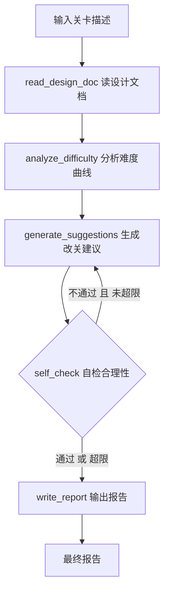

# AI 关卡设计 Agent 🧠

基于 **LangGraph（StateGraph）+ DeepSeek** 的多步推理 Agent：输入关卡描述，Agent 分步完成「读设计文档 → 分析难度曲线 → 生成改关建议 → 自检合理性 → 输出报告」，全程可视化。

A multi-step reasoning agent built with **LangGraph (StateGraph) + DeepSeek**: given a level description, it walks through *read design doc → analyze difficulty curve → suggest changes → self-check → output report*, with full step-by-step visualization.

## 特性 / Features

- 🧠 **LangGraph StateGraph 编排**：5 个节点 + 自检条件分支（conditional_edges），每步状态可在图中查看
- 📖 **读设计文档**：轻量关键词检索，按章节切块打分（无外部向量库，原理可讲清）
- 📊 **难度曲线分析**：结合 GDD 参数（跳跃高度 / 坠落速度 / 体力 / 状态机）拆解挑战点、打分、描绘难度走向
- 🛠️ **改关建议**：每条建议带具体参数（平台间距 / 检查点 / 体力补给），说明对难度曲线的影响
- 🔍 **自检合理性**：检查建议与机制参数是否冲突，输出 `【结论】可行 / 需修正`
- 🔁 **自检回炉闭环**：判定「需修正」时，携带自检意见回到 generate_suggestions 重新生成（最多回炉 2 次）
- 📄 **最终报告**：Markdown 汇总输出
- 🖥️ **Streamlit 可视化**：LangGraph 流程图 + 本轮执行路径 + 自检结论徽章 + 分步状态卡片（验收标准 ✓）

English:
- 🧠 **LangGraph StateGraph**: 5 nodes + a self-check conditional branch (conditional_edges)
- 📖 **Read design doc**: lightweight keyword retrieval over chapter blocks (no vector DB)
- 📊 **Difficulty curve analysis**: challenge breakdown + scores (1-5) grounded in GDD params
- 🛠️ **Level-change suggestions**: concrete params per suggestion, impact on the curve
- 🔍 **Self-check**: conflict detection against GDD params, ends with `【结论】可行 / 需修正`
- 🔁 **Self-check retry loop**: on "needs revision", suggestions are regenerated with the feedback (max 2 retries)
- 📄 **Final report**: aggregated Markdown report
- 🖥️ **Streamlit UI**: Mermaid graph + executed path + verdict badge + per-step cards

## 流程 / Pipeline



The `self_check` node emits a structured verdict (`【结论】可行 / 需修正`). If it says "needs revision" and the retry budget (2) is not exhausted, the agent routes back to `generate_suggestions` with the review feedback to regenerate the suggestions (a quality loop).

## 目录结构 / Structure

```
ai-level-design-agent/
├── app/
│   ├── graph.py      # StateGraph 编排（节点 + 边 + 自检条件分支回炉）
│   ├── nodes.py      # 5 个节点实现（含 Prompt 设计）
│   ├── state.py      # State 定义（流程状态 + 分步记录）
│   ├── rag.py        # 轻量设计文档检索（章节分块 + 关键词打分）
│   ├── llm.py        # DeepSeek LLM 封装（OpenAI 兼容协议）
│   ├── config.py     # 配置（API Key、路径、检索参数）
│   └── ui.py         # Streamlit 可视化入口
├── data/
│   └── onlyup_design.txt   # OnlyUp! 游戏设计文档（Agent 知识源）
├── demo.py           # 命令行演示（跑通一条链）
├── requirements.txt
├── .env.example      # 环境变量模板
└── .streamlit/       # Streamlit 主题配置
```

## 快速开始 / Quick Start

```bash
# 1. 创建虚拟环境
python -m venv .venv
.venv\Scripts\activate

# 2. 安装依赖
pip install -r requirements.txt

# 3. 配置 API Key
copy .env.example .env        # 填入 DEEPSEEK_API_KEY

# 4. 命令行跑通一条链
python demo.py

# 5. Streamlit 可视化（能看到分步推理过程）
streamlit run app/ui.py
```

## 效果示例 / Demo

命令行输出会依次展示：关卡描述 → 分步推理过程（每步节点名 + 摘要）→ 自检判定（含回炉次数）→ 难度曲线分析 → 改关建议 → 自检结论 → 最终报告。

Streamlit 界面展示：
1. 📐 **LangGraph 流程图**（Mermaid，含自检条件分支，`app.get_graph().draw_mermaid()`）
2. 🛤️ **本轮执行路径**（本次实际走过的节点序列，含回炉段）
3. ✅ **自检结论徽章**（建议可行 / 修正后可行 / 已达回炉上限）
4. 🪜 **分步推理过程**（每个节点一个状态卡片）
5. 🧩 **各节点产物**（Tab 切换查看分析 / 建议 / 自检 / 报告）

## 验收标准 / Acceptance Criteria

- [x] 能看到 Agent 的分步推理过程（LangGraph 可视化 + Streamlit 步骤卡片）
- [x] 输出建议合理（结合 GDD 参数，可落地）
- [x] 能讲清楚每一步为什么（每步节点名、输入输出、Prompt 设计均可解释）
- [x] 自检不通过时回炉重做（conditional_edges 条件分支闭环，最多 2 次）

## Roadmap / 计划

- [x] StateGraph 骨架 + 读设计文档节点 + 分析难度曲线节点 —— **一条链跑通** ✅
- [x] 生成建议 / 自检 / 输出报告节点
- [x] self_check 条件分支（conditional_edges）：不通过时携带自检意见回炉重做（最多 2 次）✅
- [ ] 接入 ChromaDB 向量检索（替代轻量关键词检索）
- [ ] 更多游戏设计文档入库

## 说明 / Notes

- DeepSeek 通过 OpenAI 兼容协议接入（`langchain-openai`）。
- 检索为轻量关键词打分，启动阶段刻意不引入向量库；详见 `app/rag.py`。
- 自检判定：解析 `self_check` 输出的 `【结论】可行 / 需修正` 行（`nodes._parse_verdict`）；无结论行时全文含「需修正/不可行/不通过」则判需修正，否则视为可行。
- 踩坑记录见 [PITFALLS.md](PITFALLS.md)。
